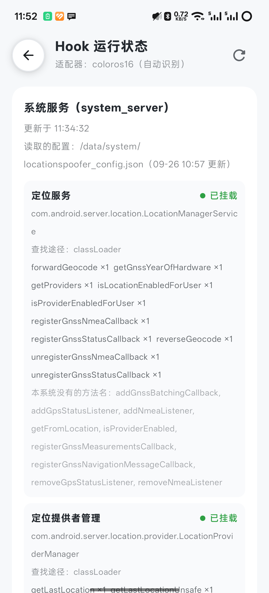
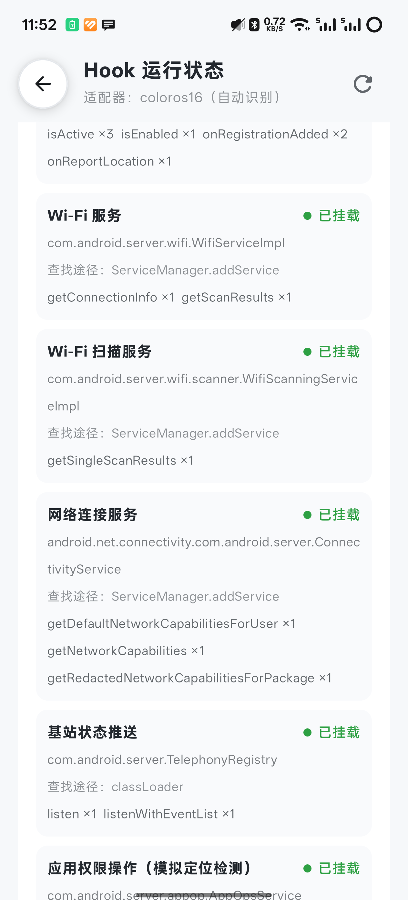
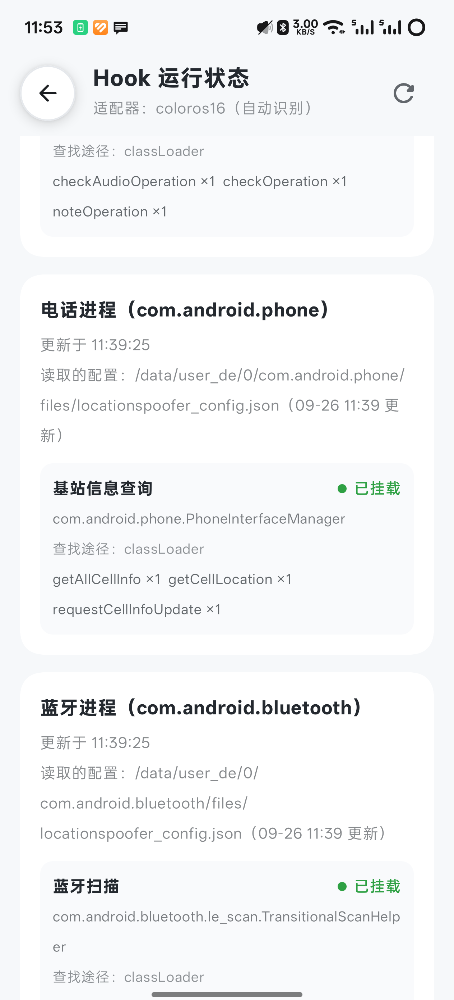

> 当前为独立原生传感器分支 `feat/coloros16-native-sensors-review`，基于无传感器评审分支。下文的“不含原生传感器”和 84 项测试描述基础评审版；此分支增加 NDK/CMake/ShadowHook、默认关闭的开关和 4 项传感器单元测试。详见 [原生实现与验证](NativeSensors-ColorOS16.md)。

# ColorOS 16 适配说明

本次修改基于 main 的 `736191c`，使用 `com.vincenthzr.locationspoofer` 包名。旧版独立定位、Wi-Fi、基站、蓝牙、GNSS 和地理编码 Hook 不再整体替换通用实现。

## 接入方式

- `core-geo` 的 `RomRules.isColorOs16` 统一判断 ColorOS 系列、ROM 主版本 16、Android API 36。测试设备 `ro.build.version.oplusrom` 为 `V16.0.0`，不限制机型或固件哈希。
- `ColorOs16Vendor` 继承 `SystemVersionVendor`，通过 `classCandidates` 补充蓝牙 `TransitionalScanHelper` 和模块化 `ConnectivityService` 的类名。通用 Hook 继续通过 `SystemClassLocator` 挂载，并自动记录 Hook 运行状态。
- 可选的定位可用性差异通过 `installExtraHooks` 追加，使用统一的 `XposedHelpers.hookAllMethods` 记录挂载结果。句柄和定时器由模块持有，热重载前关闭；适配器单例不保存运行时状态。
- 手动选择 ColorOS 厂商时，仍允许选择符合设备版本的 ColorOS 16 适配器；手动选择 AOSP 时不会启用这些扩展。
- 蓝牙接口中的 `AttributionSource` 纳入通用调用方 UID、包名提取逻辑。

### 定位派发与 BLE 修订

ColorOS 16 通过 `usesFrameworkLocationDelivery` 选择框架注册对象派发位置：`getCurrentLocation` 的取消信号、注册移除、超时和权限检查由系统处理。替换位置前深拷贝 `LocationResult`，不修改共享缓存。版本扩展仍通过 `SystemClassLocator` 和 `hookAllMethods` 挂载并记录诊断；通用 GNSS、NMEA、地理编码、Wi-Fi 和电话 Hook 继续复用。

ColorOS 16 通过 `usesFrameworkBleDelivery` 选择 `ColorOs16BleDelivery`，普通回调与 PendingIntent 都使用系统扫描队列，通用心跳不再同时运行。系统权限检查、过滤器、批量间隔及停止扫描均保留；仅应用主动 flush 可以提前发送批量结果。详见 [电话、蓝牙与报告修复验证](Phone-Ble-Report-Fix.md)。

## 行为与范围

“虚拟定位可用”默认关闭，配置键为 `force_location_enabled`。开启后，仅在模拟运行且调用方命中目标规则时覆盖定位可用性条件；不修改系统定位开关，不启用 Wi-Fi 或蓝牙硬件。保留系统原方法中的权限、用户和电源策略判断。

全局作用域沿用 main 的 `system`、`com.android.phone`、`com.android.bluetooth`。本分支不自动移除用户设置的 LSPosed 作用域。系统服务进程按进程名识别，Android 普通进程不会安装系统服务 Hook。

配置同步沿用 main 的“读取最新副本并回写”方案，不引入 `locationspoofer_config_shared.json`。保留配置加载日志和默认关闭的系统服务结构转储。`MotionRealism.kt` 与 `GaitTemplate.kt` 使用 main 原有版本。

本 PR 不包含原生传感器、NDK、CMake、ShadowHook 或原生初始化入口。原生实现拆至独立分支，使用默认关闭的开关；不属于本 PR。

WiGLE/OpenCellID 查询、环境数据构造、路线、摇杆、GNSS 与地理编码继续使用 main 的通用实现。关闭某项环境模拟不代表屏蔽所有真实环境信息；SIM、运营商和部分 ServiceState 信息仍可能按上游行为返回。

## 验证与证据范围

- 2026-09-26 拆分后的评审版：84 项 JVM 测试通过（已移除 4 项独立传感器测试）；global / scoped 两种方案、arm64-v8a / armeabi-v7a 共四个调试 APK 构建通过。
- 四个 APK 均不含 `liblocation_accel.so`、`liblocation_steps.so`、`libshadowhook.so`。评审分支不配置 NDK/CMake/ShadowHook；构建不再包含本机外部 sensor-probe 工程。
- 配置发布先原子更新 `/data/local/tmp` 兜底，再尝试系统、应用、电话与蓝牙副本。私有目录失败不阻断其他目录，命令仍返回非零，应用不会把部分同步误报为全部成功。
- `python tools/test_system_file_commands.py` 在 Android 临时目录运行实际生成的 shell 命令，使用元数据操作替身注入失败。正常、电话失败、蓝牙失败、系统失败、公共副本失败、电话 files 目录初始化失败共 6 项通过。此测试不修改真实配置，也不替代 SELinux 端到端验证。
- 真机为 PJX110，ColorOS `PJX110_16.0.1.301`，Android API 36，LSPosed IT 2.1.1（7846）。其他设备及 OxygenOS 未验证。
- 拆分前已安装完整版本的最终重启验证：三进程报告可读取、无挂载错误；五份配置同步；基站查询/请求/监听、目标隔离、蓝牙普通及 PendingIntent 扫描、过滤、批量时序、主动 flush 和目标切换通过。详见 [功能验证记录](Phone-Ble-Report-Fix.md)。
- 下列截图于 2026-09-26 从真机“系统适配 → Hook 运行状态”页采集，来自已安装的完整版本。共享 Hook 未在此次拆分中修改；截图仅证明该版本的挂载和报告读取，不能代替拆分后 APK 重启验证。
- 早期探针确认定位缓存、Wi-Fi 扫描及连接信息返回模拟数据；持续定位和最终版 Wi-Fi 尚未重新验证。运动世界校园此前出现 `SWLatLng` 空指针崩溃，未完成复测，不标记为兼容通过。
- 评审版 APK 尚未替换手机现有完整版本，拆分后的重启端到端验证待完成。原生传感器单独位于 `feat/coloros16-native-sensors-review` 分支，默认关闭；不属于本评审版。

### Hook 运行状态截图





```text
./gradlew :core-geo:test :core-data:testGlobalDebugUnitTest :xposed:testGlobalDebugUnitTest
./gradlew :app:assembleGlobalDebug :app:assembleScopedDebug
python tools/test_system_file_commands.py
```
