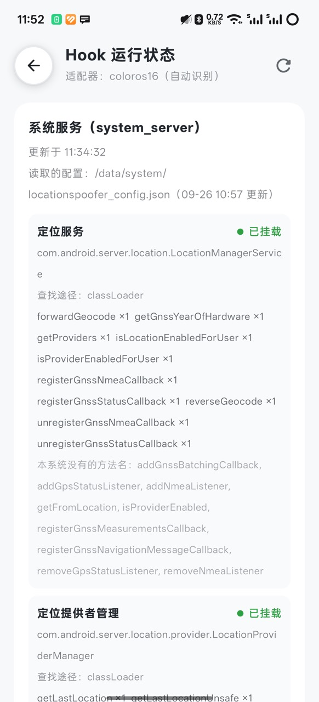
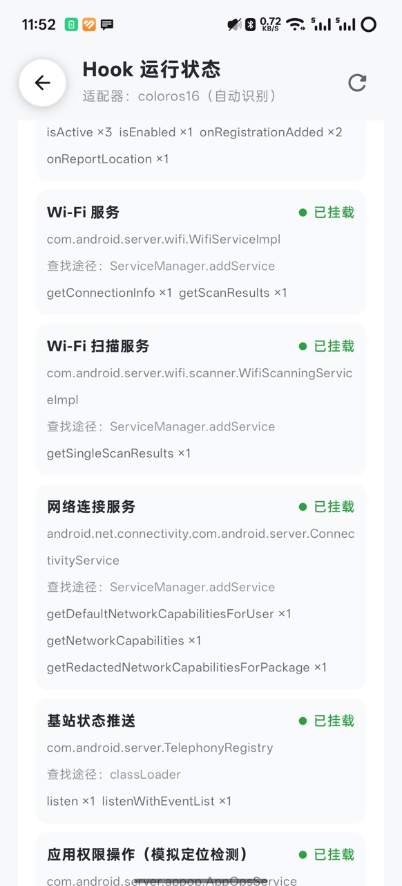
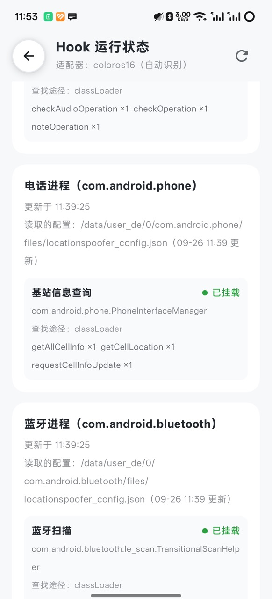

# ColorOS 16 适配说明

适用范围：ColorOS 系列、ROM 主版本 16、Android API 36（全局方案）。其他 ColorOS 版本与 OxygenOS 走厂商级适配器 `ColorOsVendor`，即通用 AOSP 基线。
验证状态汇总见 [ADAPTATION_PROGRESS.md](../../ADAPTATION_PROGRESS.md)，适配框架说明见 [vendor/README.md](../../xposed/src/main/java/com/vincenthzr/locationspoofer/xposed/hooks/vendor/README.md)。

## 接入方式

- `core-geo` 的 `RomRules.isColorOs16` 统一判断 ColorOS 系列、ROM 主版本 16、Android API 36。测试设备 `ro.build.version.oplusrom` 为 `V16.0.0`，不限制机型或固件哈希。
- `ColorOs16Vendor` 继承 `SystemVersionVendor`，通过 `classCandidates` 补充蓝牙 `TransitionalScanHelper` 和模块化 `ConnectivityService` 的类名。通用 Hook 继续通过 `SystemClassLocator` 挂载，并自动记录 Hook 运行状态。
- 版本差异通过 `installExtraHooks` 追加，统一用 `XposedHelpers.hookAllMethods` 挂载并记录结果。Hook 句柄和定时器登记在 `LocationHooker.vendorExtraHooks`，热重载前统一关闭；适配器单例不保存运行时状态。
- 手动选择 ColorOS 厂商时，仍会选中与设备版本匹配的 ColorOS 16 适配器；手动选择 AOSP 时不启用这些扩展。
- 蓝牙接口中的 `AttributionSource` 纳入通用的调用方 UID、包名提取逻辑。

### 定位与 BLE 派发

ColorOS 16 通过 `usesFrameworkLocationDelivery` 由框架注册对象派发位置：`getCurrentLocation` 的取消信号、注册移除、超时和权限检查由系统处理；替换位置前深拷贝 `LocationResult`，不修改共享缓存。通用的 GNSS、NMEA、地理编码、Wi-Fi 和电话 Hook 继续复用。

ColorOS 16 通过 `usesFrameworkBleDelivery` 由 `ColorOs16BleDelivery` 派发扫描结果，普通回调与 PendingIntent 都走系统扫描队列，通用心跳不再同时运行。系统权限检查、过滤器、批量间隔及停止扫描均保留；只有应用主动 flush 可以提前发送批量结果。

## 行为与范围

- “虚拟定位可用”默认关闭，配置键为 `force_location_enabled`。开启后，仅在模拟运行且调用方命中目标规则时覆盖定位可用性条件；不修改系统定位开关，不启用 Wi-Fi 或蓝牙硬件，保留系统原方法中的权限、用户和电源策略判断。
- 全局作用域为 `system`、`com.android.phone`、`com.android.bluetooth`，不会自动移除用户设置的 LSPosed 作用域。系统服务进程按进程名识别，Android 普通进程不会安装系统服务 Hook。
- WiGLE / OpenCellID 查询、环境数据构造、路线、摇杆、GNSS 与地理编码使用通用实现。关闭某项环境模拟不代表屏蔽所有真实环境信息；SIM、运营商和部分 ServiceState 信息仍可能按系统原样返回。

## 验证记录

测试设备：PJX110，ColorOS `PJX110_16.0.1.301`，Android API 36，LSPosed IT 2.1.1（7846），2026-09。其他设备及 OxygenOS 未验证。

重启后联合复验通过的项目：

- App 内可读取 system_server、电话、蓝牙三个进程的 Hook 运行状态报告，均无部署错误；各份配置副本内容一致。
- 基站：目标应用的缓存查询、异步请求、监听均返回配置的小区，对照应用保持真实数据。
- 蓝牙：普通回调与 PendingIntent 扫描只向目标应用返回配置的设备，对照应用保持真实结果；不匹配的地址过滤返回零结果；发现 / 丢失回调各一次；5 秒批量扫描按间隔发送，主动 flush 立即返回；从目标列表移除后恢复真实结果。
- 早期探针确认定位缓存、Wi-Fi 扫描及连接信息返回模拟数据。

尚未验证或已知限制：

- 持续定位、合并后版本的 Wi-Fi 尚未重新验证。
- 运动世界校园曾出现 `SWLatLng` 空指针崩溃，未完成复测，不标记为兼容。
- 普通回调与 PendingIntent 同时请求硬件 FIRST_MATCH / MATCH_LOST 时，系统可能因硬件资源不足拒绝第二个扫描（状态 5），属于平台限制。

配置写入逻辑可以用 `python tools/test_system_file_commands.py` 在已连接的设备上回归测试（只在 `/data/local/tmp` 下的临时目录里运行，不修改真实配置）。

### Hook 运行状态截图

